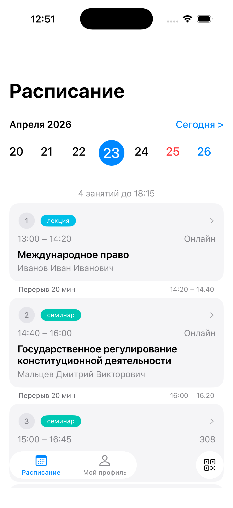
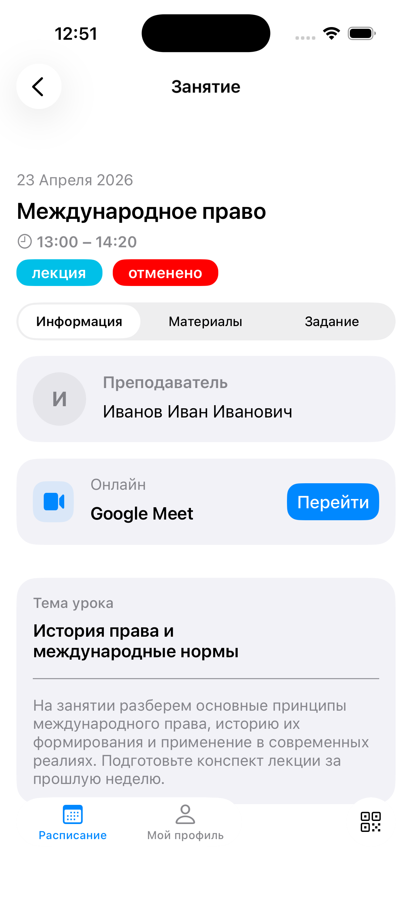
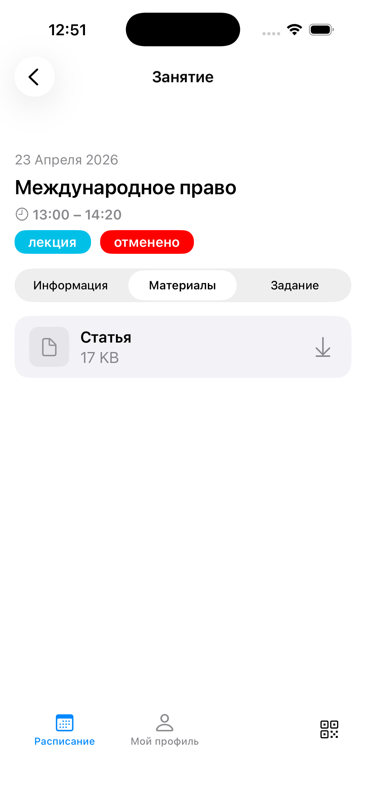
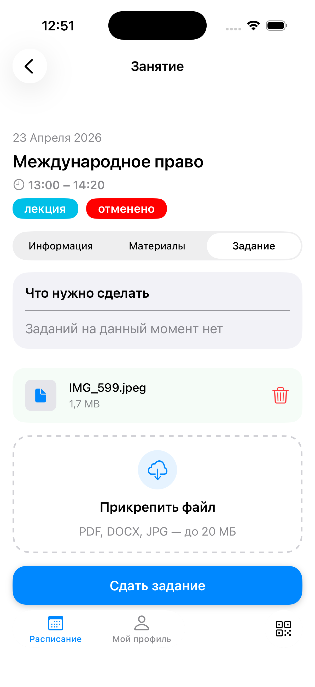
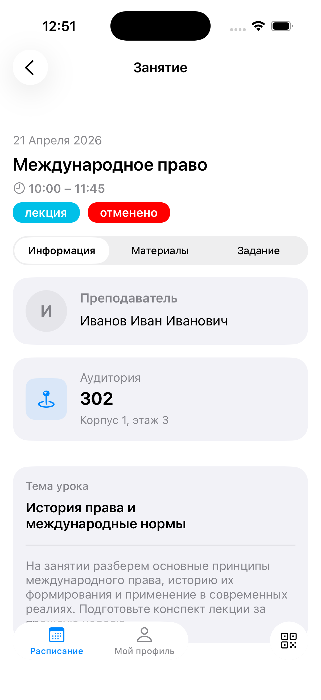
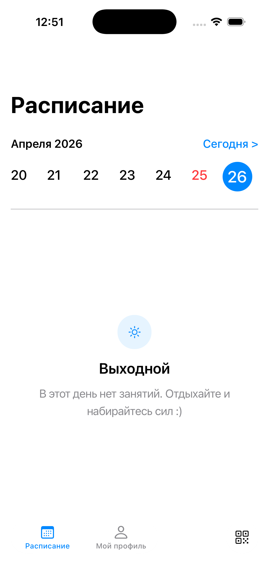

# 🗓️ ScheduleApp

> iOS-приложение для управления расписанием занятий и дедлайнов


## 📱 О приложении

**ScheduleApp** помогает студентам и школьникам удобно организовать учебное расписание:
- ✅ Просмотр расписания по дням недели
- ✅ Уведомления о предстоящих занятиях
- ✅ Отметка о выполненных заданиях
- ✅ Гибкая настройка предметов и аудиторий

## 📸 Скриншоты

| Экран | Изображение |
|-------|-------------|
| **Расписание** |  |
| **Детали занятия** |  |
| **Редактирование** |  |
| **Настройки** |  |
| **Статистика** |  |
| **Выходной день** |  |
## ✨ Фичи

- 🎨 Чистый интерфейс на **UIKit** (программная вёрстка)
- 🌓 Поддержка тёмной темы
- 🔄 Адаптивный дизайн под разные экраны

## 🛠 Технологии

| Технология | Назначение |
|------------|------------|
| **Swift 5.9** | Язык разработки |
| **UIKit** | Пользовательский интерфейс |
| **Core Data** | Локальная база данных |
| **UserNotifications** | Система уведомлений |
| **Auto Layout** | Адаптивная вёрстка |

## 🚀 Установка

### Требования
- Xcode 15.0+
- iOS 16.6+
- Swift 5.9+

### Запуск
```bash
# 1. Клонируй репозиторий
git clone https://github.com/wraxau/ScheduleApp.git

# 2. Перейди в папку проекта
cd ScheduleApp

# 3. Открой проект в Xcode
open ScheduleApp.xcodeproj

# 4. Запусти симулятор или подключи устройство
